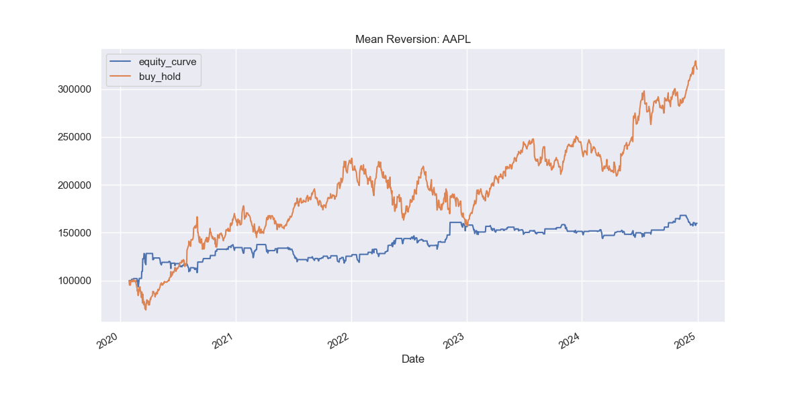
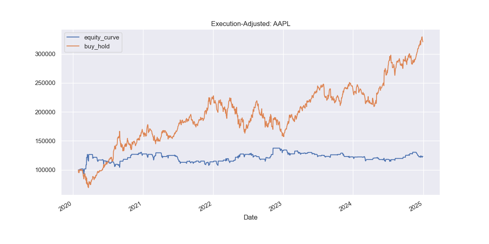
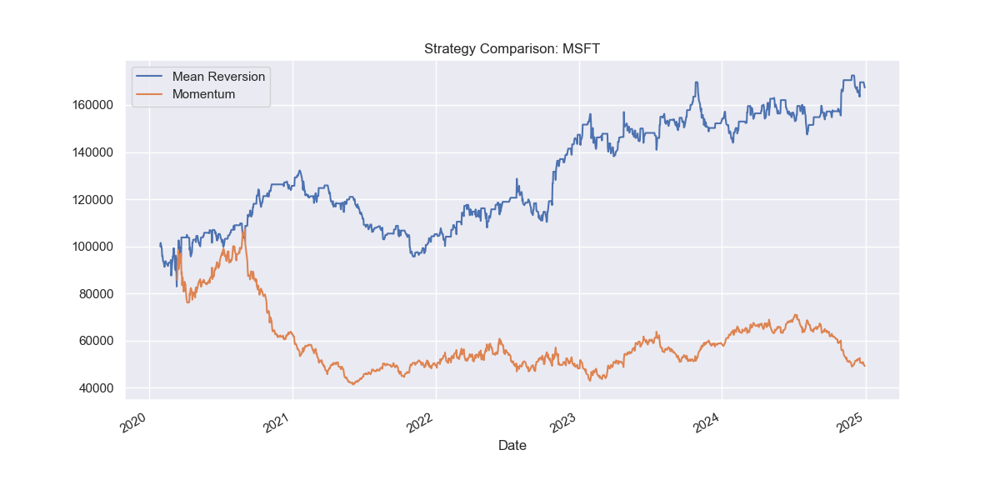
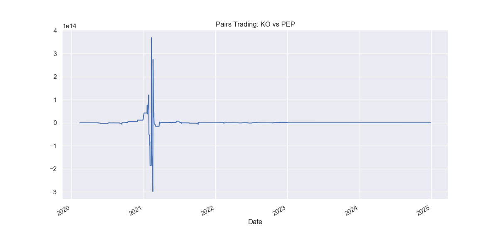
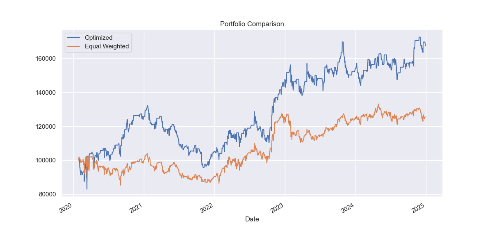
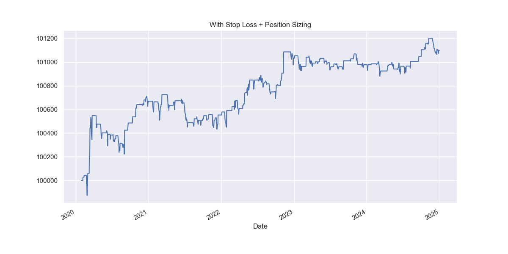

# Quantitative Trading Strategy Engine 🚀

[](https://quanttradingengine-production.up.railway.app)
[](https://python.org)
[](https://streamlit.io)
[](LICENSE)

🌐 **Live Demo:** https://quanttradingengine-renxpecutach9vh4hpwbmz.streamlit.app/

A comprehensive, modular, and extensible backtesting framework for developing, validating, and deploying quantitative trading strategies. This engine supports multiple trading approaches, built-in risk controls, performance analytics, statistical analysis 
& testing, and portfolio optimization, all tied together through an intuitive and reusable API.


---


## 🔍 Highlights


- **Backtest core** is designed with a time-series loop architecture: simulate fills, positions, returns, and equity curves.
- **Three distinct strategy templates** ready out of the box:
  - Mean Reversion (z-score)
  - Momentum (moving average crossover)
  - Pairs Trading (spread-based mean reversion)
- **Smart risk management** tools including stop-loss, position sizing by capital, and drawdown constraints.
- **Performance analytics suite**: Sharpe, Calmar Ratio, Max Drawdown, Annualized Return/Volatility.
- **Statistical testing**: Includes both t-test and bootstrap resampling to assess the strategy’s robustness.
- **Portfolio optimization** via mean-variance frontier (CVXPY), plus comparison with equal-weight implementation.
- **Standalone execution** with `main.py`, and interactive Jupyter notebooks for development & demonstration.
- **Scalable**: Easily extendable with new strategies, optimizers, or risk modules.


---


## 📁 Repository Structure


```plaintext
quant_trading_engine/
├── analytics/
│   ├── performance.py           # Performance metrics
│   └── statistical_tests.py     # t-test, bootstrap analysis
├── data
│   ├── .gitignore  
├── engine/
│   ├── backtest.py              # Core BacktestEngine class
│   └── execution.py             # ExecutionSimulator for slippage/fees
├── portfolio/
│   └── optimizer.py             # CVXPY-based optimizer, equal weight
├── risk_management/
│   ├── stop_loss.py
│   ├── position_sizing.py
│   └── drawdown_limits.py
├── strategies/
│   ├── mean_reversion.py
│   ├── momentum.py
│   └── pairs_trading.py
├── tests/
│   ├── test_backtest.py         # (Optional) Unit tests
├── utils/
├── notebooks/                   # Jupyter notebooks for prototyping/analysis
│   └── main.ipynb               # Demo orchestrator notebook
│   └── data_loader.py           # Optional API-based market data loader
├── main.py                      # Full pipeline: strategy → risk → analytics → portfolio
├── requirements.txt             # Project dependencies
├── README.md                    # Project documentation
├── LICENSE                      # MIT License (recommended)
└── .gitignore                   # Ignore caches, pyc, checkpoint files
```

---


## 🚀 Features & Usage


1. ### Backtest Engine
    - Easy-to-use: Plug any `Strategy` subclass into `BacktestEngine()`

    - Computes daily positions, returns, and equity curve

    - Tracks buy-and-hold benchmark alongside strategy for comparison
  
---

2. ### Strategy Implementations
    - Mean Reversion: Z-score entry/exits for single assets

    - Momentum: Trend-following logic via moving averages

    - Pairs Trading: Spread-based strategy for hedged pairs (e.g., KO/PEP)
  
```bash
from strategies.mean_reversion import MeanReversionStrategy
strategy = MeanReversionStrategy(window=20, z_entry=1.5, z_exit=0.5)
```
---

3. ### Risk Management Modules
     **Apply these in sny backtest pipeline**
    
    - `apply_stop_loss(df, stop_loss_pct=0.02)`
    - `apply_position_sizing(df, risk_pct=0.02)`
    - `apply_drawdown_limit(df, max_drawdown=0.1)`

---
  
4. ### Execution Simulation
      **Simulates per-trade cost and slippage:**

```bash
exec_sim = ExecutionSimulator(slippage=0.0005, fee=0.0005)
df = exec_sim.adjust_returns(df)
```
---

5. ### Performance & Statistical Analysis
      **Use `StrategyAnalytics` to compute:**

    - Sharpe Ratio, Calmar Ratio, Max Drawdown
    - Annualized Return & Volatility
    - Significance testing via t-test and bootstrap resampling

```bash
analytics = StrategyAnalytics(df, return_col='net_strategy')
print(analytics.summary())
print("Significant?", analytics.is_significant())
```
---

6. ### Portfolio Optimization
      **Combine strategy returns across tickers, optimize via mean-variance, compare to equal-weight:**

```bash
from portfolio.optimizer import optimize_portfolio, equal_weight_portfolio
w_opt = optimize_portfolio(returns_df, risk_aversion=0.5)
w_eq = equal_weight_portfolio(returns_df)
```

---


## 📈 Visual Results & Analysis

### 1. Mean Reversion Strategy – AAPL
This plot compares the mean reversion strategy’s equity curve (blue) against a simple buy‑and‑hold benchmark (orange). 

 

*Interpretation:* The strategy captures short-term reversals, shows periods of outperformance compared to hold, and illustrates drawdown behavior during trend shifts.

---

### 2. Execution‑Adjusted Equity – AAPL  
Here we apply slippage and execution cost adjustments to the strategy’s returns.

 

*Interpretation:* This more conservative equity curve highlights realistic P&L after trading friction, offering a true performance estimate.

---

### 3. Strategy Comparison – MSFT  
Side‑by‑side equity curves for mean‑reversion (blue) and momentum (orange) strategies on MSFT.



*Interpretation:* Shows how different strategy regimes (reversion vs trend) perform in different market environments.

---

### 4. Pairs Trading – KO vs PEP  
Out-of-sample backtest of a mean reversion strategy on the price spread between Coca‑Cola and Pepsi.

 

*Interpretation:* Indicates how pair‑based mean reversion can extract arbitrage profits from cointegrated stock pairs.

---

### 5. Portfolio Optimization – Optimized vs Equal Weighted  
Comparing a mean‑variance optimized portfolio against a simple equal‑weight allocation across AAPL, MSFT, and GOOGL.

 

*Interpretation:* Highlights the benefits of risk‑aware optimization in improving return per unit of risk.

---

### 6. Risk Management – Stop Loss & Position Sizing  
Applying fixed fractional position sizing and stop‑loss rules to the AAPL mean reversion strategy.  

  

*Interpretation:* Demonstrates how capital preservation techniques reduce drawdowns and smooth equity growth.

---

## 📈 Example Summary (`main.py`)

### Pipeline runs


```bash
AAPL backtest → apply execution → analytics → risk modules →
Compare MR vs Momentum on MSFT →
Run KO/PEP pairs trading →
Optimize AAPL, MSFT, GOOGL portfolio → plot performance
```
### Plots, printed summaries, and charts are generated along the way.


---


## 🔧 Installation & Setup

### 🌐 Try Live Demo
**No installation needed!** Try the live version:
👉 [https://quanttradingengine-production.up.railway.app](https://quanttradingengine-production.up.railway.app)

### 💻 Local Development Setup
```bash
git clone https://github.com/Alqama-svg/quant_trading_engine.git
cd quant_trading_engine
pip install -r requirements.txt
```

### Run locally:

```bash
python main.py
```
### Or explore interactively:

```bash
jupyter notebook main.ipynb
```

---


## 📚 Dependencies
    
    
**Core Libraries:**
- pandas, numpy, matplotlib, seaborn
- yfinance
- cvxpy  
- scipy, statsmodels

**Deployment:**
- streamlit>=1.28.0 (for web interface)
- Railway platform (for production hosting)


---


## 🧠 Key Concepts

  - **Backtesting Engine:** Core event loop that feeds historical prices to strategies, records positions, returns, and equity curve.

  - **Strategy Pattern:** Each strategy (mean reversion, momentum, pairs) inherits from a common interface and defines its own signal logic.

  - **Risk Management:** Modular application of capital control rules before return calculation.

  - **Analytics:** Computation of all key metrics and tests to evaluate whether strategy performance is statistically valid.

  - **Portfolio Optimization:** Using mean and covariance of returns to compute optimal weights that maximize return-to-risk tradeoff.


---


## 💼 Use Cases & Extensions

  - **Academic Research:** The engine provides t-tests and bootstrap resampling for strategy validation, making it ideal for academic papers, thesis projects,     and research publications. Easily extensible for custom performance metrics and novel trading strategy development with proper statistical significance testing.
  - **Quant Interviews:** The visualization suite produces publication-ready equity curves, drawdown analysis, and strategy comparison plots. Export results for regulatory reporting, investor updates, and fund performance documentation with standardized financial metrics.
  - **Strategy Development Framework:** The standardized interface allows quick implementation of custom signals, risk rules, and optimization objectives. Compare multiple strategies side-by-side and analyze performance attribution across different market regimes and asset classes.
  - **Client Reporting:** The visualization suite produces publication-ready equity curves, drawdown analysis, and strategy comparison plots. Export results for regulatory reporting, investor updates, and fund performance documentation with standardized financial metrics.
  - **Production Pivot:** The modular design allows easy connection to brokerage APIs, automated execution systems, and monitoring infrastructure. Scale from research prototype to production trading system with minimal code changes.
  - **High-Frequency Research:** Extend the execution simulation module for high-frequency trading research, including market microstructure analysis, latency modeling, and transaction cost optimization. The framework supports custom fee structures, slippage models, and order book dynamics for realistic HFT strategy evaluation.
  - **Multi-Asset Trading:** The portfolio optimization module supports cross-asset correlation analysis, sector rotation strategies, and alternative risk parity implementations across diverse investment universes.


---


## 🧩 License & Contributions

  - This project is released under the [MIT License](LICENSE). See LICENSE for full terms.

  - Contributions, forks, and pull requests are encouraged, If you add a feature, fix an issue, or refactor, let me know!


---


## ✉️ Get in Touch

Feel free to raise an issue, ask a question, or collaborate.


---


**Empower your quant research‑to‑deployment workflow with this engine!
Build, backtest, analyze, and operate trading strategies — confidently and systematically.**


---


